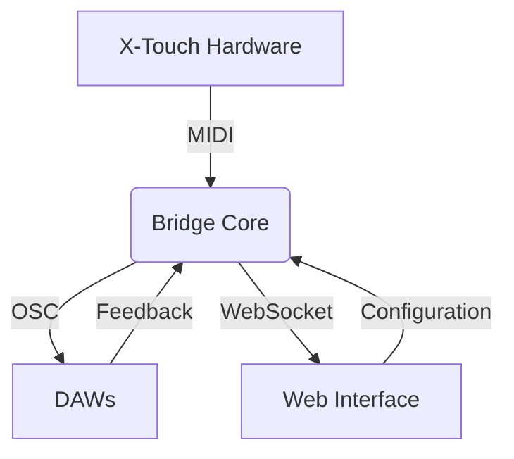

# X-Touch Extender Integration

## Project Goals
1. **Unified Control Surface**
   - Bidirectional MIDI/OSC conversion
   - 8-channel focused architecture

2. **Smart Features**
   - Button combo detection
   - Context-aware mode switching

3. **Accessible Interface**
   - Web-based control panel
   - DAW preset system

## System Architecture


### Key Workflows
1. **Hardware Integration**
   - MIDI message parsing
   - Channel state tracking

2. **OSC Routing**
   - Address translation
   - Type conversion (normalization)

3. **Web Control**
   - Real-time mirroring
   - Preset management

## Component Map
| Layer          | Technology       | Responsibility          |
|----------------|------------------|-------------------------|
| **Hardware**   | MIDI SysEx       | Physical control        |
| **Bridge**     | Python/OSC       | Protocol translation    |
| **Web**        | HTML/JS/WebSocket| User configuration      |
| **DAW**        | OSC              | Application control     |

## Development Milestones
1. **Core Bridge** (Week 1-2)
   - Basic MIDI/OSC routing
   - Channel state machine

2. **Web UI** (Week 3-4)
   - Control surface mirroring
   - Routing matrix

3. **Advanced Features** (Week 5+)
   - Combo detection
   - DAW-specific presets

## Hardware Specifications
- **Channels**: 8
- **Controls per channel**:
  - Scribble strip (7 characters)
  - Motorized fader
  - Rotary encoder (with push)
  - 4 buttons (Select, Solo, Mute, Rec)
  - VU meter (8-segment LED)

### VU Meter Protocol (8-Segment)

**Channel Addressing**
```python
# Standard MIDI Control Change
# CC# 0x50 + channel (0-7)
# Value: 0-15 (0=off, 15=full)

# SysEx Alternative (Extended Control)
F0 00 66 58  # Header
20           # Extender model
{channel}    # 0-7
4F           # VU Meter command
08           # 8 segments
{level}      # 0-15
F7           # End
```

**Segment Activation**
| Level | Segments Lit |
|-------|--------------|
| 0     | None         |
| 1-4   | Green 1-4    |
| 5-7   | + Orange 5-7 |
| 8-15  | + Red 8      |

**Web UI Implementation**
```javascript
// OSC Message Format
/xtouch/vu/{channel} {level}  // 0.0-1.0 normalized

function updateVU(channel, level) {
  const segments = Math.min(8, Math.ceil(level * 8));
  // Visual update logic
}
```

### Web UI Integration
```html
<div class="vu-meter">
  <div class="segment" data-level="1"></div>
  <!-- ... 7 more segments -->
  <div class="clip-indicator"></div>
</div>
```

## Core Objectives
1. **Channel-Focused Control**
   ```python
   # Example channel message format
   {
     'channel': 1,           # 1-8
     'scribble': {'text': 'VOL', 'color': 'blue'},
     'fader': 0.75,          # 0.0-1.0
     'buttons': {'solo': True, 'mute': False}
   }
   ```

2. **Button Combos**
   | Combo               | Action                  |
   |---------------------|-------------------------|
   | Select + Solo       | Channel preview         |
   | Rec + Mute          | Channel undo            |

3. **Visual Feedback**
   - Scribble strip mode indicators
   - LED state changes (solid/blink/off)

## Implementation Phases

### Phase 1: Basic Control
- [ ] Channel-wise MIDI mapping
- [ ] Scribble strip management
- [ ] Fader/encoder handlers

### Phase 2: Advanced Features
- [ ] Button combo detection
- [ ] Mode-specific templates
- [ ] OSC parameter mapping

### Phase 3: Web Interface
- [ ] Channel status monitoring
- [ ] Drag-and-drop OSC mapping
- [ ] Preset management

## Web Control Interface

### UI Components
1. **Channel Strips**
   ```html
   <div class="channel-strip">
     <div class="scribble-preview">VOL</div>
     <input class="fader" type="range" min="0" max="127">
     <div class="buttons">
       <button data-cc="0x20">Select</button>
     </div>
   </div>
   ```

2. **OSC Routing Matrix**
   | X-Touch Control | OSC Address |
   |-----------------|-------------|
   | Fader 1         | /live/volume|
   | Button Rec      | /live/record|

3. **Preset Manager**
   ```javascript
   presets = {
     ableton: {
       'Fader 1': '/live/volume',
       'Button Rec': '/live/record'
     }
   }
   ```

### Real-Time Feedback
```python
# WebSocket Events
{
  "event": "fader_move",
  "channel": 1,
  "value": 0.75,
  "osc_mapping": "/live/volume"
}
```

## MIDI-OSC Bridge Architecture

### Core Components
1. **Translation Layer**
   ```python
   # Bidirectional mapping examples
   MIDI_CC[select] = 0x20  →  OSC: /xtouch/button/select
   OSC /live/volume  →  MIDI Fader 1 (0x60)
   ```

2. **Channel Handling**
   | MIDI Channel | OSC Address Pattern |
   |--------------|---------------------|
   | 1-8          | /xtouch/ch{N}/...   |
   | Global       | /xtouch/master/...  |

### Message Protocols
```python
# X-Touch → OSC
Fader Move → /xtouch/fader/1 0.75  # Normalized 0.0-1.0
Button Press → /xtouch/button/rec 1  # 1=on, 0=off

# OSC → X-Touch
/live/track/name "DRUMS" → Scribble Strip Update
```

### Configuration Options
```yaml
# config/bridge.yaml
presets:
  ableton:
    mappings:
      - midi: fader1
        osc: /live/volume
        range: [0.0, 1.0]

defaults:
  osc_ip: 127.0.0.1
  osc_port: 8000
```

## Protocol Extensions
```python
# Extended SysEx for compact control
F0 00 66 58  # X-Touch header
  20         # 8-channel variant
  [DATA]    
F7

## Coding Standards, Enhancements, and Refactoring Recommendations

## 1. Frontend Improvements

### a. Component Modularity
- Refactor UI controls (rotary, fader, buttons) into reusable web components or framework components.
- Split large JS files (e.g., channel-component.js) into smaller, focused modules.

### b. State Management
- Use a centralized store for shared state (current values, OSC connection, etc.).
- Favor declarative UI updates over direct DOM manipulation.

### c. CSS & UI
- Adopt BEM or CSS Modules for class naming.
- Remove debug/temporary styles before production.
- Ensure responsive layout for various screen sizes.

### d. Accessibility
- Add keyboard navigation and ARIA labels to controls.

### e. Testing
- Add unit tests (Jest/Mocha) for JS logic.
- Add integration/UI tests (Cypress/Playwright) for user flows.

## 2. OSC & Backend

### a. Error Handling
- Gracefully handle OSC/network errors in both UI and backend.
- Provide user feedback for connection issues.

### b. Logging
- Use structured logging with configurable log levels.

### c. API/Protocol Documentation
- Auto-generate and maintain up-to-date API/OSC protocol docs.

## 3. Project & Developer Experience

### a. Documentation
- Keep this devbook up to date with setup, troubleshooting, and contribution guides.
- Document coding standards, naming conventions, and architecture.

### b. Linting/Formatting
- Add ESLint/Prettier for JS, Stylelint for CSS.

### c. Build Tools
- Use a modern bundler (Vite/Webpack/Parcel) for dev/prod builds.

### d. CI/CD
- Set up automated tests and linting on PRs (GitHub Actions, etc.).

## 4. Specific Corrections
- Refactor rotary indicator logic for correct transform-origin and rotation.
- Remove inline debugging; use a DEBUG flag or environment variable.
- Ensure consistent, idempotent component initialization.

## 5. Future-Proofing
- Consider TypeScript for type safety.
- Prepare for internationalization and theming.

---

**Prioritize modularization, documentation, and accessibility. Refactor incrementally and update this devbook with new conventions and architecture decisions.**
