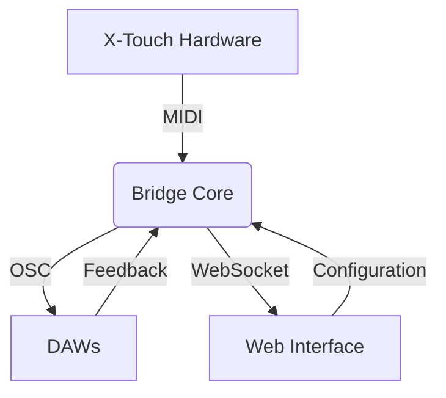
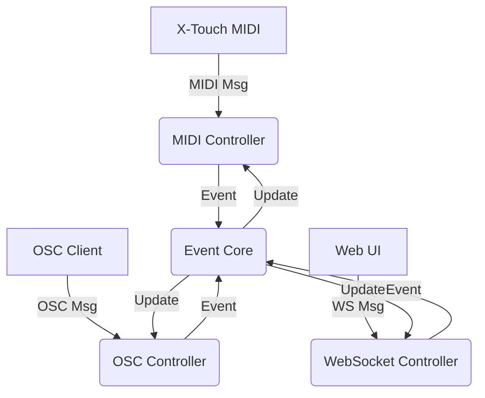

# X-Touch Extender Integration

## Project Goals
1. **Unified Control Surface**
   - Bidirectional MIDI/OSC conversion
   - 8-channel focused architecture

2. **Smart Features**
   - Button combo detection
   - Context-aware mode switching

3. **Accessible Interface**
   - Web-based control panel
   - DAW preset system

## System Architecture


### Key Workflows
1. **Hardware Integration**
   - MIDI message parsing
   - Channel state tracking

2. **OSC Routing**
   - Address translation
   - Type conversion (normalization)

3. **Web Control**
   - Real-time mirroring
   - Preset management

## Component Map
| Layer          | Technology       | Responsibility          |
|----------------|------------------|-------------------------|
| **Hardware**   | MIDI SysEx       | Physical control        |
| **Bridge**     | Python/OSC       | Protocol translation    |
| **Web**        | HTML/JS/WebSocket| User configuration      |
| **DAW**        | OSC              | Application control     |

## Development Milestones
1. **Core Bridge** (Week 1-2)
   - Basic MIDI/OSC routing
   - Channel state machine

2. **Web UI** (Week 3-4)
   - Control surface mirroring
   - Routing matrix

3. **Advanced Features** (Week 5+)
   - Combo detection
   - DAW-specific presets

## Hardware Specifications
- **Channels**: 8
- **Controls per channel**:
  - Scribble strip (7 characters)
  - Motorized fader
  - Rotary encoder (with push)
  - 4 buttons (Select, Solo, Mute, Rec)
  - VU meter (8-segment LED)

### VU Meter Protocol (8-Segment)

**Channel Addressing**
```python
# Standard MIDI Control Change
# CC# 0x50 + channel (0-7)
# Value: 0-15 (0=off, 15=full)

# SysEx Alternative (Extended Control)
F0 00 66 58  # Header
20           # Extender model
{channel}    # 0-7
4F           # VU Meter command
08           # 8 segments
{level}      # 0-15
F7           # End
```

**Segment Activation**
| Level | Segments Lit |
|-------|--------------|
| 0     | None         |
| 1-4   | Green 1-4    |
| 5-7   | + Orange 5-7 |
| 8-15  | + Red 8      |

**Web UI Implementation**
```javascript
// OSC Message Format
/xtouch/vu/{channel} {level}  // 0.0-1.0 normalized

function updateVU(channel, level) {
  const segments = Math.min(8, Math.ceil(level * 8));
  // Visual update logic
}
```

### Web UI Integration
```html
<div class="vu-meter">
  <div class="segment" data-level="1"></div>
  <!-- ... 7 more segments -->
  <div class="clip-indicator"></div>
</div>
```

## Core Objectives
1. **Channel-Focused Control**
   ```python
   # Example channel message format
   {
     'channel': 1,           # 1-8
     'scribble': {'text': 'VOL', 'color': 'blue'},
     'fader': 0.75,          # 0.0-1.0
     'buttons': {'solo': True, 'mute': False}
   }
   ```

2. **Button Combos**
   | Combo               | Action                  |
   |---------------------|-------------------------|
   | Select + Solo       | Channel preview         |
   | Rec + Mute          | Channel undo            |

3. **Visual Feedback**
   - Scribble strip mode indicators
   - LED state changes (solid/blink/off)

## Implementation Phases

### Phase 1: Basic Control
- [ ] Channel-wise MIDI mapping
- [ ] Scribble strip management
- [ ] Fader/encoder handlers

### Phase 2: Advanced Features
- [ ] Button combo detection
- [ ] Mode-specific templates
- [ ] OSC parameter mapping

### Phase 3: Web Interface
- [ ] Channel status monitoring
- [ ] Drag-and-drop OSC mapping
- [ ] Preset management

## Web Control Interface

### UI Components
1. **Channel Strips**
   ```html
   <div class="channel-strip">
     <div class="scribble-preview">VOL</div>
     <input class="fader" type="range" min="0" max="127">
     <div class="buttons">
       <button data-cc="0x20">Select</button>
     </div>
   </div>
   ```

2. **OSC Routing Matrix**
   | X-Touch Control | OSC Address |
   |-----------------|-------------|
   | Fader 1         | /live/volume|
   | Button Rec      | /live/record|

3. **Preset Manager**
   ```javascript
   presets = {
     ableton: {
       'Fader 1': '/live/volume',
       'Button Rec': '/live/record'
     }
   }
   ```

### Real-Time Feedback
```python
# WebSocket Events
{
  "event": "fader_move",
  "channel": 1,
  "value": 0.75,
  "osc_mapping": "/live/volume"
}
```

## MIDI-OSC Bridge Architecture

### Core Components
1. **Translation Layer**
   ```python
   # Bidirectional mapping examples
   MIDI_CC[select] = 0x20  →  OSC: /xtouch/button/select
   OSC /live/volume  →  MIDI Fader 1 (0x60)
   ```

2. **Channel Handling**
   | MIDI Channel | OSC Address Pattern |
   |--------------|---------------------|
   | 1-8          | /xtouch/ch{N}/...   |
   | Global       | /xtouch/master/...  |

### Message Protocols
```python
# X-Touch → OSC
Fader Move → /xtouch/fader/1 0.75  # Normalized 0.0-1.0
Button Press → /xtouch/button/rec 1  # 1=on, 0=off

# OSC → X-Touch
/live/track/name "DRUMS" → Scribble Strip Update
```

### Configuration Options
```yaml
# config/bridge.yaml
presets:
  ableton:
    mappings:
      - midi: fader1
        osc: /live/volume
        range: [0.0, 1.0]

defaults:
  osc_ip: 127.0.0.1
  osc_port: 8000
```

## Protocol Extensions
```python
# Extended SysEx for compact control
F0 00 66 58  # X-Touch header
  20         # 8-channel variant
  [DATA]    
F7

## Coding Standards, Enhancements, and Refactoring Recommendations

## 1. Frontend Improvements

### a. Component Modularity
- Refactor UI controls (rotary, fader, buttons) into reusable web components or framework components.
- Split large JS files (e.g., channel-component.js) into smaller, focused modules.

### b. State Management
- Use a centralized store for shared state (current values, OSC connection, etc.).
- Favor declarative UI updates over direct DOM manipulation.

### c. CSS & UI
- Adopt BEM or CSS Modules for class naming.
- Remove debug/temporary styles before production.
- Ensure responsive layout for various screen sizes.

### d. Accessibility
- Add keyboard navigation and ARIA labels to controls.

### e. Testing
- Add unit tests (Jest/Mocha) for JS logic.
- Add integration/UI tests (Cypress/Playwright) for user flows.

## 2. OSC & Backend

### a. Error Handling
- Gracefully handle OSC/network errors in both UI and backend.
- Provide user feedback for connection issues.

### b. Logging
- Use structured logging with configurable log levels.

### c. API/Protocol Documentation
- Auto-generate and maintain up-to-date API/OSC protocol docs.

## 3. Project & Developer Experience

### a. Documentation
- Keep this devbook up to date with setup, troubleshooting, and contribution guides.
- Document coding standards, naming conventions, and architecture.

### b. Linting/Formatting
- Add ESLint/Prettier for JS, Stylelint for CSS.

### c. Build Tools
- Use a modern bundler (Vite/Webpack/Parcel) for dev/prod builds.

### d. CI/CD
- Set up automated tests and linting on PRs (GitHub Actions, etc.).

## 4. Specific Corrections
- Refactor rotary indicator logic for correct transform-origin and rotation.
- Remove inline debugging; use a DEBUG flag or environment variable.
- Ensure consistent, idempotent component initialization.

## 5. Future-Proofing
- Consider TypeScript for type safety.
- Prepare for internationalization and theming.

---

# Bridge Core Internal Architecture

## Overview
The Bridge Core is responsible for translating and routing messages between the X-Touch hardware (MIDI), OSC clients (DAWs), and the Web UI (WebSocket). It ensures bidirectional, low-latency, and reliable communication.

### Internal Message Flow Diagram


### Pseudocode: Main Event Loop
```python
while running:
    for msg in midi_controller.poll():
        event_core.handle_midi(msg)
    for msg in osc_controller.poll():
        event_core.handle_osc(msg)
    for msg in websocket_controller.poll():
        event_core.handle_ws(msg)
    event_core.dispatch_updates()
```

---

# WebSocket Protocol

## Message Types
- `fader_move`: Fader moved on X-Touch or UI
- `button_press`: Button pressed
- `scribble_update`: Scribble strip text/color change
- `vu_update`: VU meter level
- `preset_change`: Switch mapping preset
- `config_update`: Update bridge configuration
- `error`: Error/diagnostic message

## Example Payloads
```json
{
  "event": "fader_move",
  "channel": 2,
  "value": 0.63,
  "osc_mapping": "/live/volume"
}

{
  "event": "error",
  "message": "OSC connection lost",
  "severity": "warning"
}
```

---

# Example Mapping Files

## YAML Mapping Example
```yaml
presets:
  ableton:
    mappings:
      - midi: fader1
        osc: /live/volume
        range: [0.0, 1.0]
      - midi: button_rec
        osc: /live/record
        type: bool

  reaper:
    mappings:
      - midi: fader1
        osc: /track/volume
        range: [0.0, 1.0]
```

## Creating a New Preset
1. Copy an existing preset block.
2. Change the preset name and OSC addresses as needed.
3. Save and reload bridge (or use Web UI if supported).

---

# Error Handling & Diagnostics

- All controllers (MIDI, OSC, WS) log errors with timestamps and severity.
- The Web UI displays connection and mapping errors in real time.
- Diagnostic commands available via WebSocket (e.g., `ping`, `dump_state`).
- Use verbose logging for troubleshooting: enable with a config flag or UI toggle.
- Typical troubleshooting steps:
  1. Check hardware and cable connections
  2. Verify OSC/WS IPs and ports
  3. Use Web UI diagnostics tab for live status
  4. Inspect logs for errors or dropped messages

---

# Known Limitations & Future Plans

## Current Limitations
- RTP-MIDI support may require manual setup
- Some DAW-specific features may not be mapped by default
- Web UI authentication is basic (improve security for remote use)
- No plugin system for custom logic yet

## Mapping Layers & Mode Switching via Control Combos

To expand the capabilities of the X-Touch control surface, the mapping system supports multiple "layers" or "modes" that can be recalled using specific button combinations (combos) on the hardware. For example, pressing Channel 1 REC and Channel 8 REC simultaneously can activate a new mapping layer, effectively multiplying the available controls.

### How It Works
- Each mapping layer defines a different set of MIDI-to-OSC and OSC-to-MIDI assignments.
- Layer switching is triggered by user-defined combos (e.g., specific button or button+encoder presses).
- The active mapping layer determines how incoming MIDI/OSC messages are routed.
- Layer state is reflected in the Web UI and can be visualized for clarity.

### Example YAML Mapping with Layers
```yaml
presets:
  ableton:
    layers:
      default:
        mappings:
          - midi: fader1
            osc: /live/volume
          - midi: button_rec
            osc: /live/record
      alt_layer:
        trigger_combo:
          - channel: 1
            control: rec
          - channel: 8
            control: rec
        mappings:
          - midi: fader1
            osc: /live/sendA
          - midi: button_rec
            osc: /live/clip/launch
```

### Logic
- When the specified combo (e.g., Channel 1 REC + Channel 8 REC) is detected, the `alt_layer` mappings become active.
- Releasing the combo (or pressing another defined combo) returns to the `default` layer or switches to another layer.
- This allows for context-sensitive control, macro layers, and more advanced workflows.

### Benefits
- Greatly expands the number of controls without additional hardware.
- Enables user-defined workflows and DAW-specific optimizations.
- Can be extended to support more complex combos, timed presses, or sequences.

---

### Two-Step Layer Selection (Combo + Choice)

To make the layer selection more user-friendly and powerful, the system can support a two-step process:

1. **Combo Activation**: User presses a defined button combo (e.g., Channel 1 REC + Channel 8 REC).
2. **Layer Choice Prompt**: The system updates X-Touch scribble strips to present available layer options (e.g., "Tracks 9-16", "EQ", "Compressor", "Gate"). The user then confirms the desired layer by pressing an additional control (e.g., a select button on the channel strip).

This approach allows for context-sensitive, dynamic assignment of layers, and provides clear visual feedback to the user.

#### Example YAML Mapping for Two-Step Layer Selection
```yaml
presets:
  ableton:
    layers:
      default:
        mappings:
          - midi: fader1
            osc: /live/volume
      layer_chooser:
        trigger_combo:
          - channel: 1
            control: rec
          - channel: 8
            control: rec
        choices:
          - id: tracks_9_16
            label: "Tracks 9-16"
            select_button: 1  # Channel 1 select
          - id: eq
            label: "EQ"
            select_button: 2  # Channel 2 select
          - id: compressor
            label: "Compressor"
            select_button: 3  # Channel 3 select
        # No direct mappings; this layer only presents choices
      tracks_9_16:
        parent: layer_chooser
        mappings:
          - midi: fader1
            osc: /live/track/9/volume
      eq:
        parent: layer_chooser
        mappings:
          - midi: rotary1
            osc: /live/track/selected/eq/gain
      compressor:
        parent: layer_chooser
        mappings:
          - midi: rotary1
            osc: /live/track/selected/compressor/threshold
```

#### Logic
- When the combo is pressed, the system enters the `layer_chooser` state and updates scribble strips with the options' labels (e.g., "Tracks 9-16", "EQ", "Compressor").
- The user confirms their choice by pressing the corresponding select button.
- The selected layer (`tracks_9_16`, `eq`, or `compressor`) becomes active, and its mappings are used until another combo/layer change.
- Optionally, the system can display the current layer on the scribble strips for ongoing feedback.

#### Benefits
- Reduces accidental layer switching by requiring explicit confirmation.
- Makes advanced workflows discoverable and user-friendly.
- Allows for more than two or three layers without memorizing complex combos.

---

## Future Plans
- Add plugin API for custom mappings and behaviors
- Improve Web UI for drag-and-drop mapping
- Add support for more OSC-enabled software
- Enhance diagnostics (traffic monitor, message inspector)
- Expand documentation and add video tutorials

---

**Prioritize modularization, documentation, and accessibility. Refactor incrementally and update this devbook with new conventions and architecture decisions.**
